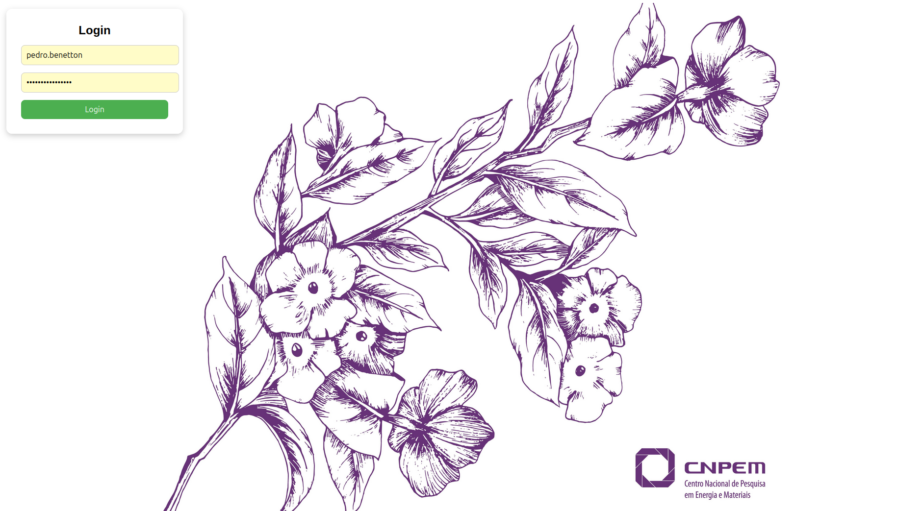
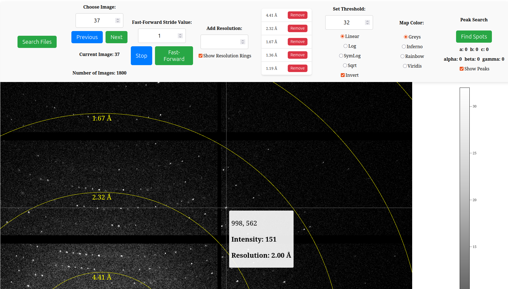
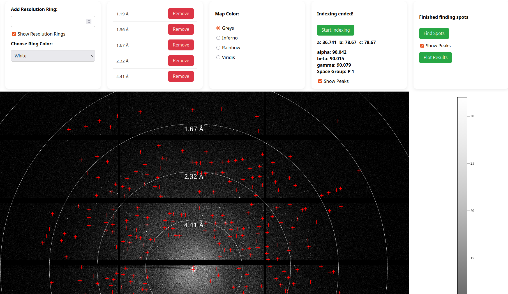
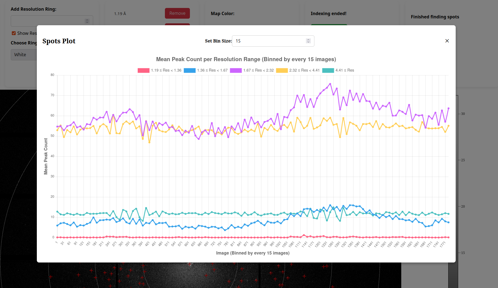

# arara - Analisador de Reflexões de Aquisições de Raios-X

```
git clone https://gitlab.cnpem.br/BEAMLINES/MANACA/gui/arara.git
cd arara/app
mkdir find_spots
cd find_spots
mkdir xds
cd ..
mkdir keys
# Contact pedro.benetton@lnls.br to obtain your public key, which
# must be placed inside the keys folder
cd ..
podman-compose up -d
```
Users must login with their CNPEM credentials:


Logged users can access images collected in the MANACÁ beamline
in their proposals:


Indexing with DIALS and finding spots with XDS available:



