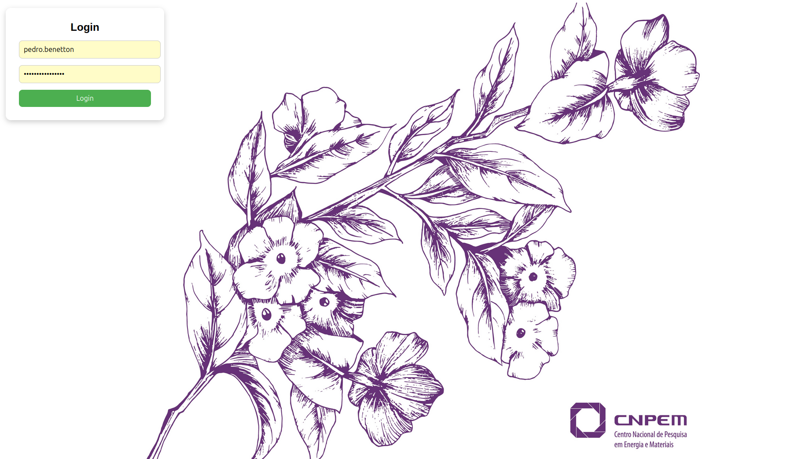
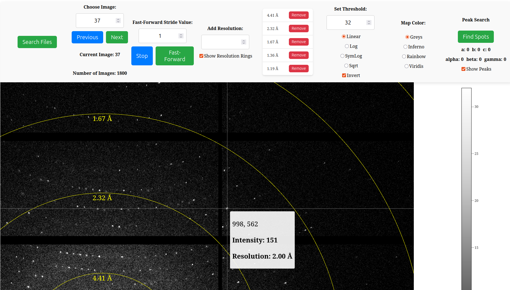

# arara - Analisador de Reflexões de Aquisições de Raios-X

```
git clone https://gitlab.cnpem.br/BEAMLINES/MANACA/gui/arara.git
cd arara/app
mkdir find_spots
mkdir xds
mkdir keys
# Contact pedro.benetton@lnls.br to obtain the .env files and
# the public key, which must be placed inside the keys folder
```

Later, start the app with:
```
podman-compose up -d
```
Users must login with their CNPEM credentials:


Logged users can access images collected in the MANACÁ beamline
in their proposals:

